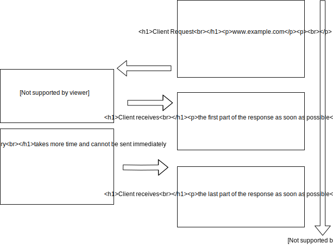
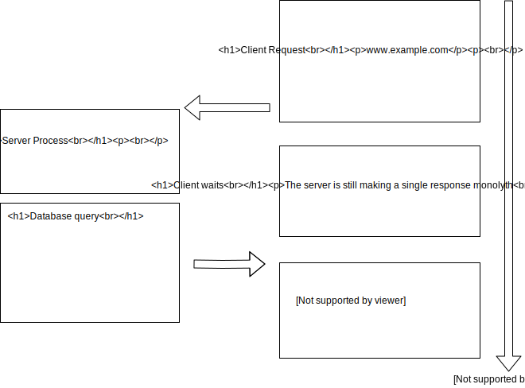

# HTML Streaming

HTML streaming is a browser feature. Streaming in programming is a gerneral purpose word to define a continous process as opposed to a long stand alone blocking one. Streaming with video means playing the first seconds while the rest is still downloading. In HTML it means that while the HTML document is still being downloaded, the first parts are already parsed and executed. That is why it is generally a good idea to put `<style>` as early as possible in the HTML document. From an user's persective, that is very convenient, the user can already read the first paragraph, while the rest of the document is still being downloaded. Nowadays, to experience the benefits of this feature, visit a page with a big document on a low brandwidth connection.

## Downloading is a Multy Party Process

There is a sender and a receiver. The receiver, in our case, a web browser can process received information before having received all of it. It can also pause, resume and cancel the process. The sender, a web server, can also pause, resume and cancel the process. The implication is that the sender can precisely control the timing.

## Timing Controls

The web server can control the timings, in other words, control when a HTML tag is being displayed. To demonstrade this capability: `npm run demo1`. In this example the response is split into individual letters with ```.split(``)```. They are then send one by one with a delay using `setInterval()`. The visual effect is living text being written, streamed.

## Leveraging HTML Streaming for Real Time Web Apps

Extending the previous example, it is possible to display any real time data that the server receives while the connection is open. To demonstrate this, two routes are created: `controller` and `viewer`. Controller contains an `<input type="number">` that uses web sockets to send its last value when it change. Viewer, displays that last value using HTML streaming *without* web sockets. The problem is that old values are still in there, because old nodes are not removed. `npm run demo2`

## Using CSS to hide previous values

The following CSS hides all but the last paragraph:

```
p:not(:last-of-type) {
    display: none;
}
```

## HTML Streaming to send data as soon as possible

In a typical dynamic website a request to a page from a logged user shows a page with static content, dynamic content and user specific content. Without HTML streaming all has to be loaded before anything has to be sent. With HTML streaming, the early parts of HTML can be sent while a database query is going on. The rest is then sent as soon as possible. This can reduce the time the user sees a blank page.

With html streaming 

Without html streaming 

## Details

### `<iframe>`s for multiple HTML Streaming sources

### `<td>` as an Escape Hatch to HTML Streaming

The content of `<td>` is not rendered at all until the entire row has been received.

## Limitations

The page loading indicator keeps spinning.

Service worker pass through is limited.

Incompatibility with existing tools.

CSS selector last-of-type appears buggy sometimes.

Additional work to make inputs.

### Timeouts

HTTP streaming stops after a certain amount of time, for example after 120 seconds after the last TCP frame was received. So this is a problem if there are long pauses in between two `response.write`

One solution could be to listen for the document loaded event and when it occurs do refresh with js `location.href = location.href;`, or with html `<meta http-equiv="refresh" content="230"`.

In NodeJS the HTTP timeout can be extedend with `server.timeout = TIME_OUT_LIMIT;`


## Sources

https://www.ebayinc.com/stories/blogs/tech/async-fragments-rediscovering-progressive-html-rendering-with-marko/
https://stackoverflow.com/questions/42589522/why-is-facebooks-html-wrapped-inside-a-table-mobile-login-page
https://stackoverflow.com/questions/49515634/css-last-of-type-does-not-match-while-still-loading

## Going Beyond

Is it possible to refresh the page without JavaScript ? Yes see demo3

What are the costs/benefits of HTML streaming on low tier devices and Internet of Things ?

More concrete use cases ?

